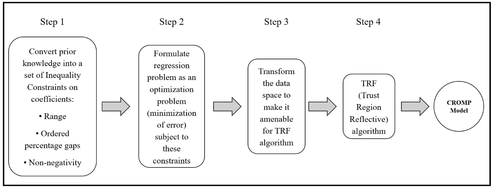

[](https://zenodo.org/badge/latestdoi/545916375)
[](https://pypi.org/project/cromp/)
[](https://github.com/kb-open/CROMP/blob/main/LICENSE.txt)
[](https://pypi.org/project/cromp/)
[](https://github.com/kb-open/CROMP/actions/)

# ✏️ CROMP (Constrained Regression with Ordered and Margin-sensitive Parameters) 
This repo provides the official implementation of CROMP (Constrained Regression with Ordered and Margin-sensitive Parameters) along with the test dataset and the test pipeline code to reproduce the benchmarking results as described in the CROMP paper ("**Constrained Regression with Ordered and Margin-sensitive Parameters: Application in improving interpretability for wage models with prior knowledge**").

Author: [Kaushik Bar](kb.opendev@gmail.com)


---------------------------
## 🎯 Quick Info
CROMP allows: 
* User-defined order among the coefficients
* User-defined minimum margins (i.e., percentage gaps) between the coefficients
* User-defined lower and upper bounds for each coefficient
* Coefficients without any order or margin restrictions

This package is both interpretable and accurate.
There is no other package / library available in the public domain today with these capabilities.

---------------------------
## 💻 Installation
Install using [PyPI](https://pypi.org/project/cromp/):
```bash
pip install cromp
```

---------------------------
## 💻 Dependencies
The package depends on:
* python >= 3.6
* scipy
* numpy
* pandas

The tests depend additionally on:
* scikit-learn
* [Data scientist salary data](https://www.kaggle.com/datasets/nikhilbhathi/data-scientist-salary-us-glassdoor?select=data_cleaned_2021.csv)
* [Ames House price data](https://www.kaggle.com/competitions/house-prices-advanced-regression-techniques/data?select=train.csv)
* [SCB Sweden wage data](https://www.statistikdatabasen.scb.se/pxweb/en/ssd/START__AM__AM0103__AM0103F/SLP1t12/table/tableViewLayout1/)

---------------------------
## 🚀 Usage
Below is a minimal usage guide. This library aloows flexibility for more fine-grained controls for each coefficient separately.
Please go through the [tests](https://github.com/kb-open/cromp/blob/main/tests/cromp_tests.py) in addition to see more examples.

```python
>>> from cromp import CROMPTrain, CROMPPredict

>>> df = pd.read_csv("tests/data/ames_house_prices_data.csv")
>>> df_train = df.iloc[:-50, :]
>>> df_test = df.iloc[-50:, :]

>>> target_col = 'SalePrice'
>>> feats_in_asc_order = ['1stFlrSF', 'TotalBsmtSF', 'GrLivArea']
>>> feats_in_no_order = []

>>> # Instantiate model
>>> model = CROMPTrain()

>>> # Configure constraints
>>> ret_success = model.config_constraints(feats_in_asc_order, min_gap_pct=0.5, feats_in_no_order, lb=0.0, ub=100.0, no_intercept=True)

>>> # Train
>>> ret_success, cromp_model = model.train(df_train, target_col)

>>> # Predict
>>> model = CROMPPredict(cromp_model)
>>> result = model.predict(df_test)
```

---------------------------
## ☕ Contact
Feel free to contact [Kaushik Bar](https://www.linkedin.com/in/iamkbar/) if you have any further questions / feedback.

Author Affiliation: [Inxite Out Pvt Ltd](https://inxiteout.ai/)

---------------------------
## Citation
To cite CROMP in your work, please use the following bibtex reference:

```bibtex
@software{Bar_CROMP_Constrained_Regression_2022,
author = {Bar, Kaushik},
license = {MIT},
month = {10},
title = {{CROMP (Constrained Regression with Ordered and Margin-sensitive Parameters)}},
url = {https://github.com/kb-open/CROMP},
year = {2022}
version = {v0.0.3},
publisher = {Zenodo},
doi = {10.5281/zenodo.7152807},
url = {https://doi.org/10.5281/zenodo.7152807}
}
```

